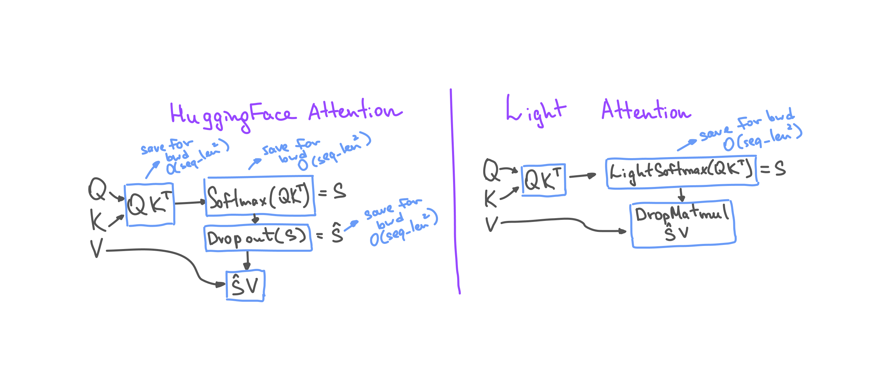

#  Light Attention

This project reduces memory requirements of attention mechanism. This is achieved by two adjustments: Softmax function that doesn't save inputs for backward computation and a merged Dropout + Matmul operation.



## Light Softmax
Attention mechanism uses softmax on the output of Q*K.T operation. Thus, both input and output of a Softmax layer allocate O(seq_length^2) memory. 
Vanilla Softmax implementation in PyTorch saves both input and output for a backward operation. 
Implementation in this repository computes gradients using only layer outputs. This allowes reduction in memory requirements by O(seq_length^2).


To use LightSoftmax outside of attention block, import it with:
```
from light_attention.nn.functional.light_softmax import light_softmax

light_softmax(x)
```

To use LightSoftmax in Attention block you can import either LightAttention module or whole LightGPT2 model:
```
from transformers import GPT2Config
from light_attention.nn.modules.transformer import LightAttention, LightGPT2LMHeadModel, LightGPT2Model

config = GPT2Config(use_lightsoftmax=True)
attn = LightAttention(config)
model = LightGPT2Model(config)
```

## Merged DropMatmul
When using dropout before multiplying Softmax output (S) by Values tensor (V) PyTorch saves both input to Dropout and input to Matmul operation (both require O(seq_length^2) memory). This repository offers a merged Dropout + Marmul layer which computes gradients using only S and a Dropout mask. 


To use DropMatmul outside of attention block, import it with:
```
from light_attention.nn.functional.drop_matmul import drop_matmul

drop_matmul(x)
```

To use Dropmatmul in Attention block you can import either LightAttention module or whole LightGPT2 model:
```
from transformers import GPT2Config
from light_attention.nn.modules.transformer import LightAttention, LightGPT2LMHeadModel, LightGPT2Model

config = GPT2Config(use_dropmatmul=True)
attn = LightGPT2Attention(config)
model = LightGPT2Model(config)
```

You can use both DropMatmul and LightAttention in the same block:
```
config = GPT2Config(use_lightsoftmax=True, use_dropmatmul=True)
```

## Benchmarks

### PyTorch==1.10 
(PyTorch==1.11 negates the effect of lightsoftmax. Probably because of in 1.11 the SoftMax oprator was implemented the same way. DropMatmul still gives about 20% memory reduction.) 
Experiment was conducted on a single GPU NVIDIA A100 80Gb. Memory stats for a training loop of classic GPT2 model configurations(gpt2-small/-medium/-large/-xl) and batch_size==4 (memory is measured right after forward step to calculate the difference in activations size):
| Model  | Max Memory Allocated, MB | Max Memory Reserved, MB |
|  :---:  |  :---:  |  :---:  |
| Vanilla gpt2-small | 12119.3 | 12654.0 |
| Light gpt2-small | 7799.3 | 7902.0 |
| Vanilla gpt2-medium | 32351.1 | 33558.0 |
| Light gpt2-medium | 20831.1 | 20870.0 |
| Vanilla gpt2-large | 61104.6 | 63376.0 |
| Light gpt2-large | 39504.6 | 39616.0 |
| Vanilla gpt2-xl | - | - |
| Light gpt2-xl | 67049.8 | 67132.0 |

```-``` means that there was not enough memory to perform a single forward-backward iteration with this configuration.

### PyTorch==1.11
<!-- | Model  | Max Memory Allocated, MB | Max Memory Reserved, MB |
|  :---:  |  :---:  |  :---:  |
| Vanilla gpt2-small | 9815.3 | 10322.0 |
| Vanilla gpt2-small <br /> (mixed precision training) | 7821.6 | 8196.0 |
| Light gpt2-small | 7799.3 | 7886.0 |
| Light gpt2-small <br /> (mixed precision training) | 6813.8 | 6964.0 | -->

| Model  | Activations Memory, MB | Activations Memory (with Mixed Precision Training), MB |
|  :---:  |  :---:  |  :---:  |
| Vanilla gpt2-small | 9327.8 | 7334.0 |
| Light gpt2-small | 7311.8 | 6326.03 |

Command to run an experiment: 
```shell
$ python eval_gpt_memory.py \
    --n_layer=12 \
    --n_head=12 \
    --n_embd=768 \
    --n_positions=1024 \
    --batch_size=4 \
    --light_softmax \
    --drop_matmul \
    --mixed_precision \
    --seed=3407
```
Example output: 
```
Pytorch version: 1.11.0+cu102
Namespace(batch_size=4, drop_matmul=True, light_softmax=False, mixed_precision=True, n_embd=768, n_head=12, n_layer=12, n_positions=1024, save_graph=False, seed=3407)

Before placing the model on GPU
MA 0.0312 MB         Max_MA 0.0312 MB         CA 2.0 MB         Max_CA 2.0 MB

After placing the model on GPU:
MA 487.5 MB         Max_MA 487.5 MB         CA 542.0 MB         Max_CA 542.0 MB

Params (empirical) 487.4688 MB

After input batch generation, before forward pass:
MA 487.5 MB         Max_MA 487.5 MB         CA 542.0 MB         Max_CA 542.0 MB

After forward pass, before backward pass:
MA 6813.5396 MB         Max_MA 6813.5396 MB         CA 6964.0 MB         Max_CA 6964.0 MB

Activations (empirical) 6326.0396 MB

After backward:
MA 963.3267 MB         Max_MA 963.3267 MB         CA 7456.0 MB         Max_CA 7456.0 MB

```
Optional arguments:
```
  -h, --help            show this help message and exit
  --n_layer N_LAYER     number of transformer blocks
  --n_head N_HEAD       number of attention heads
  --n_embd N_EMBD       embeddings dimention
  --n_positions N_POSITIONS
                        max context length
  --batch_size BATCH_SIZE
                        batch size
  --light_softmax       flag that indicates whether to use light_softmax or
                        pytorch softmax
  --drop_matmul         flag that indicates whether to use drop_matmul or
                        unfused implementation of dropout and matmul
  --mixed_precision     flag that indicates whether to use mixed precision
  --seed SEED           random seed
  --save_graph          flag that indicates whether to use save the backward
                        computation graph (try not to save graphs for networks
                        with more than a couple of transformer blocks since
                        resolution is not enough to adequately depict it)
```


## UnitTests
```python -m unittest discover -p test_*.py -t . -s light_attention```

Tests check that light_softmax and drop_matmul produce same outputs and gradients as the original functions. 

## Notebook Examples
```notebooks/LightGPT2AttentionTest.ipynb``` checks memory, numerical correctness and speed of LightGPT2Attention module in comparison with the HuggingFace GPT2Attention

```notebooks/LightGPT2Test.ipynb``` checks memory, numerical correctness and speed of LightGPT2 model in comparison with the HuggingFace GPT2

### Attributions
Code in this repository is a modified version of gpt2 model from [huggingface transformers](https://github.com/huggingface/transformers).
Icon is taken from [Flaticon](https://www.flaticon.com/free-icons/lightweight).
