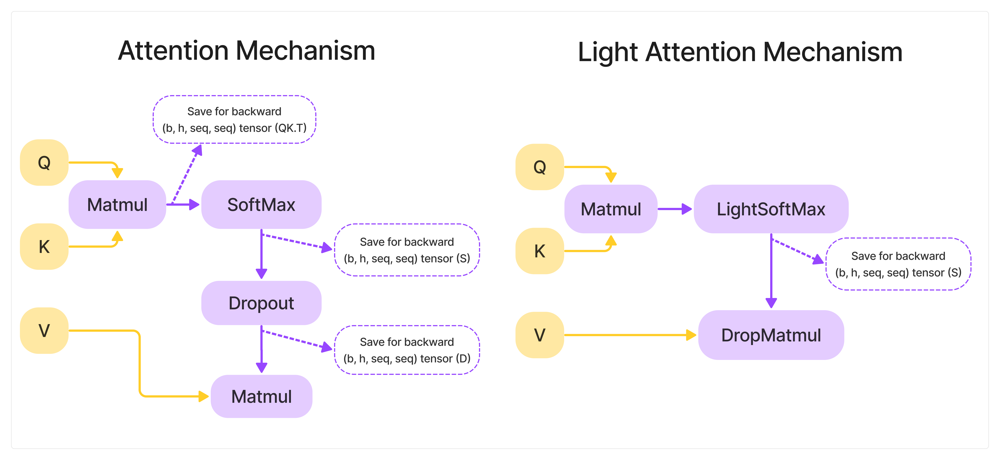

#  Light Attention

This project reduces memory requirements of attention mechanism. This is achieved by two adjustments: Softmax function that doesn't save inputs for backward computation and a merged Dropout + Matmul operation.

## Light Softmax
Attention mechanism uses softmax on the output of Q*K.T operation. Thus, both input and output of a Softmax layer allocate O(seq_length^2) memory. 
Vanilla Softmax implementation in PyTorch saves both input and output for a backward operation. 
Implementation in this repository computes gradients using only layer outputs. This allowes reduction in memory requirements by O(seq_length^2).

## Merged DropMatmul
When using dropout before multiplying Softmax output (S) by Values tensor (V) PyTorch saves both input to Dropout and input to Matmul operation (both require O(seq_length^2) memory). This repository offers a merged Dropout + Marmul layer which computes gradients using only S and a Dropout mask. 

## Benchmarks
Memory stats for a training loop of classic GPT2 model(batch_size=4, blocks=12, seq_length=1024, emb_size=768):
| Model  | Max Memory Allocated, MB | Max Memory Reserved, MB | Activations Memory, MB |
|  :---:  |  :---:  |  :---:  |  :---:  |
| Vanilla gpt2  | 12119.3 | 12654.0 | 11631.8 |
| Light gpt2  | 7799.3 | 7902.0 |  7311.8 |
